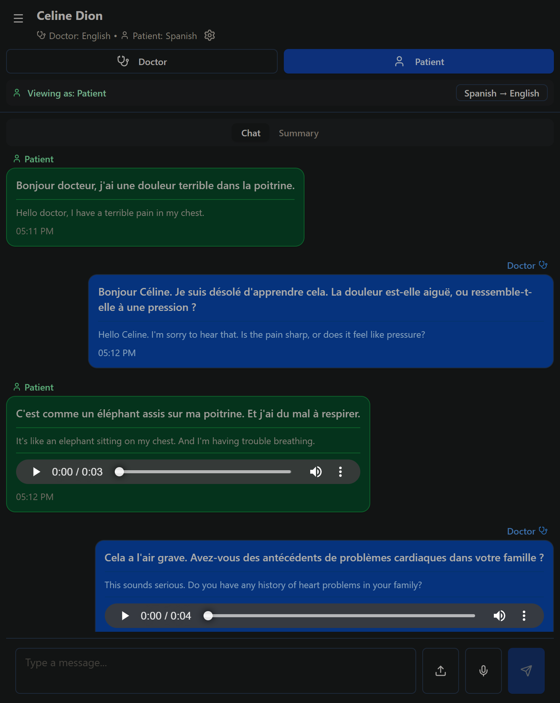

# MediTranslate - Frontend

Real-time healthcare translation app connecting doctors and patients across language barriers. Built with React + Vite for Nao Medical's take-home assignment.

## 🚀 [Live Demo](https://medi-translate-rosy.vercel.app)

> **Note:** First load may take 30-60s as the backend wakes from sleep (free tier).

---

## 📸 Screenshots

### Desktop View

*Doctor-Patient conversation with real-time translation*

### Mobile View
<p float="left">
  
</p>

### Key Features Demo

*Recording and transcribing audio with visual feedback*


*Searching conversations and generating AI medical summaries*

---

## ✨ Features

- 🌍 **15+ Languages** - Real-time bidirectional translation
- 🎤 **Audio Recording** - Browser-based recording with automatic transcription
- 💬 **Text Chat** - Clean, role-based messaging interface
- 🔍 **Search** - Keyword search across all conversations with highlighting
- 📋 **AI Summaries** - Medical summaries with symptoms, diagnoses, follow-ups
- 📱 **Mobile Responsive** - Full functionality on phones and tablets
- 🎨 **Modern UI** - Built with shadcn/ui components

---

## 🛠️ Tech Stack

- **React 18** + Vite
- **Tailwind CSS** + shadcn/ui
- **Supabase** (PostgreSQL + Storage)
- **lucide-react** icons
- **jsPDF** for exports

---

## 🚀 Quick Start

```bash
npm install
cp .env.example .env
# Add your API keys to .env
npm run dev
📖 Detailed setup instructions: See SETUP.md

📦 Environment Variables
text
VITE_API_URL=https://meditranslate-backend.onrender.com
VITE_SUPABASE_URL=your_supabase_project_url
VITE_SUPABASE_ANON_KEY=your_supabase_anon_key
🏗️ Project Structure
text
src/
├── components/
│   ├── Chat/
│   │   ├── ChatInterface.jsx    # Main chat component
│   │   ├── ChatInput.jsx         # Text + audio input
│   │   └── MessageBubble.jsx     # Message display
│   ├── Sidebar/
│   │   └── ConversationList.jsx  # Search + list
│   └── ui/                       # shadcn components
├── App.jsx
└── main.jsx

🔗 Related
Backend Repository: (https://github.com/PaawanBarach/MediTranslate-backend)

API Documentation: Backend API Docs

👤 Author
[Paawan Barach]

GitHub: @PaawanBarach
