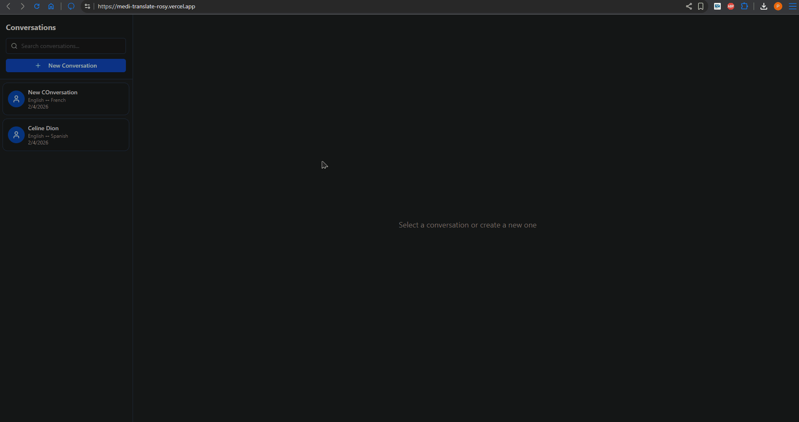
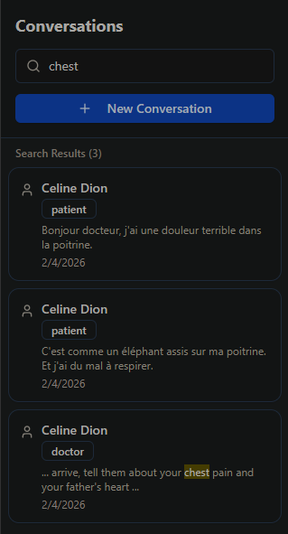
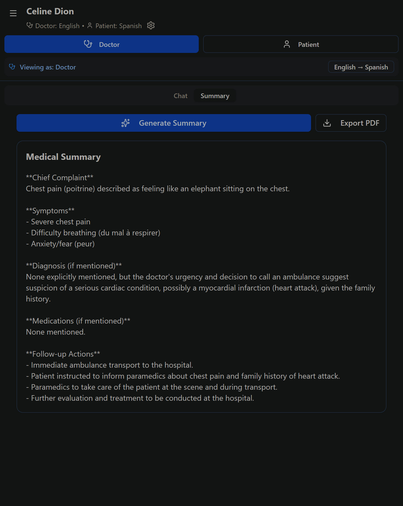

# MediTranslate - Frontend

Real-time healthcare translation app connecting doctors and patients across language barriers. Built with React + Vite for Nao Medical's take-home assignment.

## 🚀 [Live Demo](https://medi-translate-rosy.vercel.app)

> **Note:** First load may take 30-60s as the backend wakes from sleep (free tier).

---

## 📸 Screenshots & Demo

### Key Features Demo

*Recording and transcribing text with visual feedback*

### Desktop View

*Doctor-Patient conversation with real-time translation*


*Patient's perspective of the conversation*

### Mobile View
<p float="left">
  
</p>

### Search & AI Summary

*Keyword search across all conversations*


*AI-powered medical summaries with symptoms, diagnoses, and follow-ups*

---

## ✨ Features

- 🌍 **15+ Languages** - Real-time bidirectional translation
- 🎤 **Audio Recording** - Browser-based recording with automatic transcription
- 💬 **Text Chat** - Clean, role-based messaging interface
- 🔍 **Search** - Keyword search across all conversations with highlighting
- 📋 **AI Summaries** - Medical summaries with symptoms, diagnoses, follow-ups
- 📱 **Mobile Responsive** - Full functionality on phones and tablets
- 🎨 **Modern UI** - Built with shadcn/ui components

---

## 🛠️ Tech Stack

- **React 18** + Vite
- **Tailwind CSS** + shadcn/ui
- **Supabase** (PostgreSQL + Storage)
- **lucide-react** icons
- **jsPDF** for exports

---

## 🚀 Quick Start

```bash
npm install
cp .env.example .env
# Add your API keys to .env
npm run dev
```

📖 **Detailed setup instructions:** See [SETUP.md](./SETUP.md)

---

## 📦 Environment Variables

```env
VITE_API_URL=https://meditranslate-backend.onrender.com
VITE_SUPABASE_URL=your_supabase_project_url
VITE_SUPABASE_ANON_KEY=your_supabase_anon_key
```

---

## 🏗️ Project Structure

```
src/
├── components/
│   ├── Chat/
│   │   ├── ChatInterface.jsx    # Main chat component
│   │   ├── ChatInput.jsx         # Text + audio input
│   │   └── MessageBubble.jsx     # Message display
│   ├── Sidebar/
│   │   └── ConversationList.jsx  # Search + list
│   └── ui/                       # shadcn components
├── App.jsx
└── main.jsx
```

---

## 🤖 AI Tools Used

- **ChatGPT/Claude** - Component architecture, debugging
- **GitHub Copilot** - Code completion
- **Groq API** - Translation (Llama 3.3 70B) + Transcription (Whisper Large v3)

---

## 📝 Key Technical Decisions

**Why Vite over Next.js?**
- Faster dev server for rapid iteration
- Simpler deployment to Vercel
- Smaller bundle size

**Why shadcn/ui?**
- Unstyled primitives = full customization
- Copy-paste components = no dependency bloat
- Tailwind integration

---

## ⚠️ Known Limitations

- No offline mode (requires internet)
- No multi-device sync (WebSocket not implemented)
- Search is keyword-based (not fuzzy)
- Audio recording only (no file upload)

---

## 🚀 Deployment

**Vercel (Recommended)**
```bash
vercel --prod
```

**Manual Build**
```bash
npm run build
# Deploy /dist folder to any static host
```

---

## 🔗 Related

- **Backend Repository:** [github.com/PaawanBarach/MediTranslate-backend](https://github.com/PaawanBarach/MediTranslate-backend)
- **API Documentation:** [Backend API Docs](https://meditranslate-backend.onrender.com/docs)

---

## 👤 Author

**Paawan Barach**
- GitHub: [@PaawanBarach](https://github.com/PaawanBarach)

---

## 📄 License

MIT - Built for Nao Medical take-home assignment (Feb 2026)
